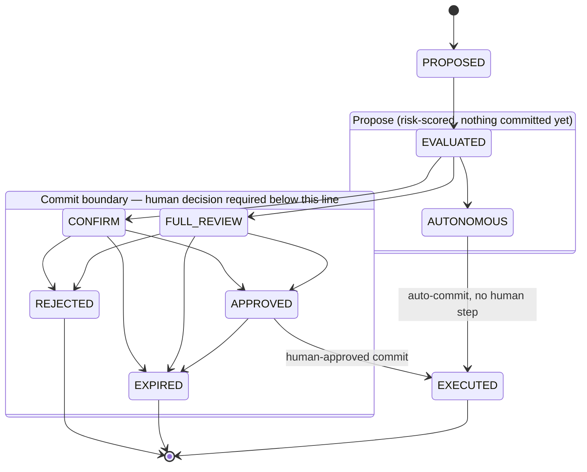
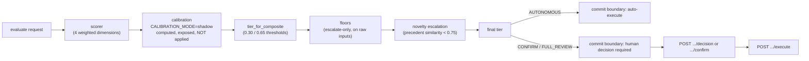

# PS-9.1 — Graduated Autonomy Engine

## Traceability

| Success criterion | Proven by | Endpoint | Video |
|---|---|---|---|
| Bulk delete → full review | `test_bulk_delete_routes_to_review` | `POST /v1/actions/evaluate` | 0:00 |
| Single update → confirmation | `test_single_update_routes_to_confirm` | `POST /v1/actions/evaluate` | 0:00 |
| Read-only → autonomous | `test_read_only_routes_autonomous` | `POST /v1/actions/evaluate` | 0:00 |
| Breakdown accurate & readable | `test_audit_breakdown_is_human_readable` | `GET /v1/audit` | 0:00 |

(timestamps filled after T-20; all four tests live in `tests/test_routing.py`, the T-08 criterion tests — READ-ONLY since T-08)

## What this is

A governance service that scores every proposed AI-agent action for risk
and routes it to one of three tiers — **AUTONOMOUS** (auto-executes),
**CONFIRM** (any differently-identified human may approve, 30-minute
approval TTL), or **FULL_REVIEW** (human approval required, 4-hour TTL).
Every routing decision is written to an append-only, hash-chained audit
log with a plain-English explanation of why that tier was chosen.

## 1. Live URLs

Both deployments run the same commit (`3047533`, tag `clean-v2`) and
share the same Neon database — curl-verified together, side by side;
see `governance/evidence/final-closeout-clean-v2.txt` for the full
parity table, fingerprint table, and fuzz/unicode-fix verification on
both.

Staleness is now a single `GET /v1/version` on each deployment (D-31) —
returns `git_sha`, `build_time`, and live dependency versions read via
`importlib.metadata`, rather than the behavioral/forensic reconstruction
earlier incidents (D-16, D-22) required.

- **Railway (production)**: https://aivartba-production.up.railway.app
  — curl-verified against all three tiers (AUTONOMOUS / CONFIRM /
  FULL_REVIEW), `/livez`, `/readyz`, `/v1/version`, and `/v1/audit/verify`.
- **AWS Lambda + Function URL**: https://ym22rmfd6h3cyvu6tdv5a3mo7e0tsies.lambda-url.us-east-1.on.aws/
  — curl-verified against the same three tiers, `/livez`, `/readyz`,
  `/v1/version`, and `/v1/audit/verify`. Deploy path:
  `infra/aws/deploy-lambda.sh` builds from this repo's own root (the
  Dockerfile lives here directly — D-26) and pushes to ECR; see
  D-21–D-23 in `governance/plan/03-errors-and-fixes.md` for real failure
  modes hit getting this working (image manifest format, updates that
  silently didn't apply, IAM permissions that covered creation but not
  later operations). App Runner was never an option — closed to new
  customers since 30 Apr 2026.

**Secrets storage differs by platform, deliberately (D-36):** Lambda's
`DATABASE_URL`/`OPENAI_API_KEY`/`OPENAI_MODEL` are being migrated to SSM
Parameter Store as `SecureString`, resolved at cold start and cached for
the process lifetime — closing the exposure vector `aws lambda
get-function` opened (it returns plaintext env vars in its metadata).
`DATABASE_URL_DIRECT` is deliberately NOT present on Lambda: it never
runs migrations. **Railway has no equivalent secret store** — its
`DATABASE_URL`/`DATABASE_URL_DIRECT`/`OPENAI_API_KEY` remain plain
service variables, protected only by the tooling guardrails in
`scripts/scan-secrets.sh`, `scripts/check-var.sh`, and the `pre-commit`
hook (see `CLAUDE.md`'s NEVER-DUMP section) — not by platform-level
encryption at rest. This is a real asymmetry, not an oversight to be
read as parity with Lambda's SSM migration.

## 2. Quickstart

```bash
git clone <this-repo-url> && cd aivar_tba
pip install -r requirements.txt
cp .env.example .env   # then fill in DATABASE_URL, DATABASE_URL_DIRECT, OPENAI_API_KEY, OPENAI_MODEL
alembic upgrade head
uvicorn app.main:app --reload
```

`DATABASE_URL` is the **pooled** Neon connection string (app runtime);
`DATABASE_URL_DIRECT` is the **direct** one (Alembic migrations only) —
mixing them up produces `relation does not exist` errors. See
`.env.example` for the full variable list.

## 3. Architecture

The state machine (`app/state_machine.py`) is the only mutation path.
The **propose/commit boundary** is where AUTONOMOUS actions execute
immediately, while CONFIRM/FULL_REVIEW actions require a separate human
decision before anything commits:



`POST /v1/actions/evaluate` moves `PROPOSED → EVALUATED → {AUTONOMOUS |
CONFIRM | FULL_REVIEW}`. Only `AUTONOMOUS` actions commit without a
human ever touching them; `CONFIRM`/`FULL_REVIEW` actions sit at
`EVALUATED`'s far side until `POST /v1/actions/{id}/decision` moves them
to `APPROVED` or `REJECTED` — a genuinely separate step, not a formality.

**The evaluate pipeline**, as it actually runs today in
`app/main.py::evaluate()` — not as originally designed, since
calibration and novelty were added after the state machine above:



In `shadow` mode (the default; `enforce` is not set anywhere in this
repo or its Railway config) calibration's output is attached to the
response but never reaches step D — the composite that determines the
tier is the scorer's output unmodified. Floors read the *raw* request
fields (`reversibility`, `affected_records`, `regulatory`,
`llm_confidence`), not the composite, so calibration cannot suppress a
floor even in `enforce` mode (`app/risk/floors.py::final_tier` is a
`max()` over the weighted tier and the floor tier — escalate-only,
proven by `tests/test_floors.py` and, for calibration specifically,
`tests/test_calibration.py::test_enforce_mode_cannot_suppress_full_review_floor`).

## 4. The risk model

Four dimensions, each normalized to 0.0–1.0, combined as a weighted sum
(`app/risk/scorer.py:24-56`). **The weights are frozen** — see
`CLAUDE.md`.

| Dimension | Weight | Bands |
|---|---|---|
| Reversibility | 0.40 | read 0.0 · update-with-snapshot 0.4 · update-without-snapshot 0.7 · delete/send/pay 1.0 |
| Data scope | 0.30 | 0→0.0 · 1→0.2 · 10→0.4 · 100→0.6 · 1k→0.8 · 10k+→1.0 (log-scaled on affected records) |
| Regulatory | 0.20 | none 0.0 · internal 0.3 · PII/GDPR 0.7 · PHI/SOX 1.0 |
| Confidence | 0.10 | `1.0 − llm_confidence` — low confidence RAISES risk |

**Rationale for the ordering** (reversibility outranks data scope,
which outranks regulatory, which outranks confidence): reversibility
gets the largest weight because it bounds
the *worst case* directly — an irreversible action has no undo path
regardless of how many records it touched or how confident the model
was. Data scope is second because blast radius compounds any other
risk. Regulatory sensitivity is weighted lower than either because it's
already independently covered by a hard floor (below) rather than
relying on the weighted sum alone to catch it. Confidence gets the
smallest weight deliberately — a low-confidence LLM call is a *signal*
to escalate, not proof of danger by itself, and it's independently
backstopped by its own floor too. This ordering is original reasoning
written for this README, not sourced from an existing document — worth
reading closely rather than taking as pre-approved.

The confidence dimension is expressed as uncertainty: all four
dimensions run in the same direction, where higher means higher risk.
An LLM confidence of 0.20 contributes an uncertainty of 0.80. The
low-confidence floor (`low_confidence_on_mutation`, D-14) operates
independently on the raw LLM confidence, forcing CONFIRM when it is
< 0.5 **and** the action is a mutation — reads are exempt, since a
read carries no consequence to be wrong about. The continuous score
and the safety floor are two separate mechanisms reading the same
signal.

## 5. Override floors — why a pure weighted sum is insufficient

Floors (`app/risk/floors.py`) are checked *after* the weighted score and
can only escalate a tier, never lower one — proven by the escalate-only
sweep (T-07). Real, live example (`governance/evidence/OD-1-raw-full-review-case.json`):

```
REQUEST:  {"action_type":"delete","reversibility":"irreversible",
           "affected_records":5000,"regulatory":"none"}
DIMENSIONS: reversibility 1.00 × 0.40 = 0.400
            data_scope    0.80 × 0.30 = 0.240
            regulatory    0.00 × 0.20 = 0.000
            confidence    0.02 × 0.10 = 0.002
                                        -------
                          composite  = 0.642
RESPONSE: composite=0.642, tier=FULL_REVIEW, floor_name=irreversible_bulk,
          explanation="0.64 -> FULL_REVIEW (floor: irreversible action
          affecting 5000 records (>= 100))."
```

The weighted composite alone is **0.642** — inside the 0.30–0.65 CONFIRM
band, not FULL_REVIEW. Left to the weighted sum by itself, a genuinely
confident LLM call on a large irreversible action could land at
CONFIRM: any single human could wave it through. The `irreversible_bulk`
floor overrides that unconditionally once `affected_records >= 100` on
an irreversible action, forcing FULL_REVIEW regardless of how the four
weighted dimensions add up. The other three floors do the same for
regulated-data mutations, low LLM confidence, and any unrecoverable
mutation — each closes a specific way the weighted sum alone could
under-escalate. (This composite is not a fixed constant: the confidence/
uncertainty dimension comes from a live LLM call, so it varies a few
hundredths between runs — see §11's note on re-evaluation reproducibility.)

## 6. Security controls

- **S-1 Payload hash pinning** — `params_hash` computed over
  canonicalized JSON at evaluate time; `confirm`/`execute` must present
  the same hash or get `409 Conflict`. Why: the most common HITL
  production bug is the approval UI showing one thing while the
  arguments mutate before execution — the human approved something
  that didn't happen.
- **S-2 Idempotency keys** — client-supplied on evaluate/execute; a
  replay returns the original result instead of creating a second
  action or executing twice.
- **S-3 Approval TTL** — every approval has an `expires_at` (CONFIRM 30
  min, FULL_REVIEW 4 hours); expired approvals cannot execute.
- **S-5 Hash-chained audit** — every row stores `prev_hash` +
  `entry_hash`; `/v1/audit/verify` walks the chain and reports
  integrity, so tampering is detectable, not merely discouraged.
- **S-6 Separation of duties** — `reviewer_id` must differ from the
  proposing `agent_id`; an agent cannot approve its own action.

One test per control plus a concurrency race test (two concurrent
decisions on the same item, resolved via a conditional UPDATE — zero
rows affected → 409, not a read-then-write) — see `tests/test_security.py`.

## 7. Compliance mapping

**This section states what design features map to external frameworks.
It is not a claim of legal compliance.**

**EU AI Act, Regulation (EU) 2024/1689, Article 14 ("Human oversight")**
— Article 14(4) requires that human overseers be enabled to: (a)
understand the system's capacities/limitations and duly monitor its
operation; (b) remain aware of automation bias; (c) correctly interpret
the system's output; (d) decide not to use it, or to disregard/override/
reverse its output; (e) intervene or stop it. This design maps to
several of those:

- **(a) understand/monitor** — the hash-chained audit log
  (`GET /v1/audit`) and every decision's plain-English, counterfactual
  explanation string.
- **(c) correctly interpret output** — the same explanation strings are
  specifically designed to be human-readable (T-06a, T-08's fourth
  criterion test), not raw scores.
- **(d) decide not to use / override / reverse** — the
  `POST /v1/actions/{id}/decision` endpoint (approve/reject) for every
  CONFIRM/FULL_REVIEW action, with S-6 preventing an agent from
  rubber-stamping its own action.
- **(e) intervene / stop** — approval TTLs (S-3) bound how long an
  unactioned decision can sit, and REJECTED is terminal.

**OWASP Top 10 for Agentic Applications (2026)** (OWASP GenAI Security
Project) — several `ASI` categories map to specific controls here:

- **ASI03 Identity and Privilege Abuse** → S-6 separation of duties.
- **ASI09 Human-Agent Trust Exploitation** → the LLM confidence cache
  only ever stores genuine successes, never degraded/failed results
  (Issue 2 fix), and the system fails closed on LLM failure rather than
  defaulting to a trust-inducing "autonomous" outcome.
- **ASI10 Rogue Agents** → override floors apply independently of any
  single LLM call, and the hash-chained audit log makes deviation from
  expected behavior detectable after the fact.
- **ASI01 Agent Goal Hijack** → `app/llm.py`'s prompt explicitly frames
  `action_type`/`resource`/`params` as untrusted data, not instructions
  (T-13 Finding 4a) — this reduces, not eliminates, prompt-injection
  risk; the floors are the actual backstop, not the prompt wording.

## 8. Project management

**Method**: Kanban, WIP limit 1 (one task in progress at a time, per
`CLAUDE.md`'s operating contract), a Definition of Done per task, and
six gates (G0–G5) — see `governance/gates/`.

- `governance/plan/01-implementation-plan.md` — task board and status.
- `governance/plan/02-action-log.md` — append-only record of what was done
  and why, per task.
- `governance/plan/03-errors-and-fixes.md` — defect register plus the
  `LEFT OUT` section (scope explicitly cut or deferred).
- `governance/charter.md` — scope, frozen list, gate schedule.
- `governance/gates/`, `governance/blocks/` — gate and block reports; each one
  records its own branch and commit (see L-J below — why that matters).
- `governance/evidence/` — raw command/curl/pytest output backing every
  DoD claim in the action log.

**Evidence discipline**: no task in the action log is marked done
without a pasted command/curl/pytest artifact alongside it — a green
build log alone is never treated as proof (see §10, DMAIC/Measure).

**Measured metrics** (each traceable to the exact command that produced
it — see the commit that added this table for the full command log):

| Metric | Value | Command |
|---|---|---|
| Tests passing / skipped | 164 passed, 6 skipped | `pytest -q` |
| Source LOC (`app/` + `app/risk/` + `cli.py`) | 3,129 | `wc -l app/*.py app/risk/*.py cli.py` |
| Test LOC (`tests/`) | 2,681 | `wc -l tests/*.py` |
| Test-to-source ratio | ≈0.86:1 | 2,681 / 3,129 |
| Endpoints | 13 | `grep -c "^@app\.\(get\|post\)" app/main.py` |
| Commits | 75 | `git rev-list --all --count` |
| Defects logged / resolved | 23 logged (D-01–D-31, some numbers reserved), 20 fixed or resolved, 3 open by accepted decision (D-13 pre-D-29-fix boundary case superseded by D-29's general fix; D-23 IAM scope, behavioral workaround in place; D-30 a process finding, not a code defect) | `grep -c "^\| D-" governance/plan/03-errors-and-fixes.md` |
| First commit | 2026-08-19 18:39:53 +0530 | `git log --reverse --format="%ci" \| head -1` |
| Latest commit | 2026-08-20 16:22:15 +0530 | `git log -1 --format="%ci"` |
| Defects logged | 14 (D-01–D-14) | `grep -cE "^\| D-[0-9]+" governance/plan/03-errors-and-fixes.md` |
| LEFT OUT entries | 23 | counted directly in `governance/plan/03-errors-and-fixes.md`'s `## LEFT OUT` section |
| Evidence files | 61 | `find governance/evidence -type f \| wc -l` |
| Live concurrency p95 (T-19, 50 concurrent requests) | 29,796 ms – 29,796.1 ms across two runs | read from `governance/evidence/T-19-concurrency.txt`, not re-run |
| Coverage | not measured | `pytest --cov` is not a registered pytest option in this environment despite `pytest-cov` being importable — not installed/fixed to avoid a scope-creep environment change |

## 9. Known limitations and next steps

(from `governance/plan/03-errors-and-fixes.md`'s `LEFT OUT` section, verbatim)

- No application logic in T-04 (scaffold only, per task spec).
- No CORS configuration — deliberate, not an oversight. This API is a
  service-to-service governance endpoint, not consumed from browser JS
  on a different origin. See `app/main.py`'s comment above `app =
  FastAPI()`.
- T-08: `router.route_action`'s explanation, when a floor fires, states the
  floor's own reason (e.g. "irreversible action affecting 500 records (>=
  100)") but does not compute a floor-specific counterfactual ("would have
  been CONFIRM if affected_records < 100"). Production approach: extend
  each floor's reason with its own avoidance condition once a concrete
  need for it appears (e.g. in T-18's README worked example) — not needed
  to satisfy T-08's literal assertions (composite + tier + triggering
  reason present in the string).
- T-10: idempotency_key is accepted and stored on evaluate/execute
  requests but not yet enforced (no replay-returns-original-result
  behavior). S-2's dedicated enforcement + test is T-12's job.
- T-10: approval expiry (S-3) is enforced lazily — checked at execute
  time, not by a background sweep — since no scheduler exists. An
  approval past its expires_at is only actually marked EXPIRED when
  something reads/executes it. Acceptable for this system's shape (no
  external party needs to observe "expired" before then), but worth
  naming: `GET /v1/actions/{id}` does NOT currently trigger the same
  lazy-expiry check that `execute` does, so a stale GET can show a
  not-yet-expired APPROVED state past its TTL until execute is attempted.
  Production approach: apply `_check_expiry` in the GET handler too, or
  add a scheduled sweep — deferred since T-10's own DoD doesn't require
  it and no endpoint's correctness depends on GET reflecting expiry
  eagerly.
- T-10: `/v1/audit` filtering/pagination is basic (action_id, event_type,
  limit/offset) — no cursor-based pagination or filtering by date range.
  Sufficient for T-10's DoD ("filterable, paginated"); can be extended if
  a later task needs more.
- ~~T-11: the 9 business endpoints read/write InMemoryStore, not
  Postgres~~ — RESOLVED by the pre-T-14 Issue 1 fix. All 9 endpoints now
  use `SQLAlchemyStore`/`SQLAlchemyAuditLog` at runtime, verified by a
  direct Postgres query showing real persisted rows and a live
  multi-connection concurrency proof. See the "Issue 1 fix" action-log
  entry.
- ~~G2: transient LLM failures cached indefinitely~~ — RESOLVED by the
  pre-T-14 Issue 2 fix. `OpenAIConfidenceProvider` now only caches
  `degraded=False` results. See the "Issue 2 fix" action-log entry.
- Pre-T-14 Issue 1 fix: `audit_records` has no DB-level enforcement of
  "APPEND-ONLY, never UPDATE, never DELETE" — that's currently true only
  because application code never issues those statements. A Postgres
  trigger or `REVOKE UPDATE, DELETE` grant would enforce it at the DB
  level. Explicitly deferred as a separate, out-of-scope hardening step
  per the approved plan (not part of "swap the store").
- Pre-T-14 Issue 1 fix: `test_db_store.py`'s real-DB tests run
  function-scoped (fresh engine/connection pool per test, ~20s each,
  ~2 minutes for the file) due to a pytest-asyncio event-loop-scoping
  incompatibility with module-scoped async fixtures (D-08). Production
  approach if this becomes a CI time problem: pin an explicit
  `asyncio_default_fixture_loop_scope` (module or session) in
  `pytest.ini` and re-test module-scoped fixtures against that config,
  or accept the per-test cost as this project already has.
- T-13 Finding 3 (boundary brittleness), ACCEPTED as a documented
  limitation per product owner decision — not fixed, frozen thresholds
  unchanged, no calibration logic added. A fresh-session adversarial
  review found the composite score is brittle near both frozen
  thresholds: a 0.006 change in `llm_confidence` (0.505→0.499) flips
  CONFIRM↔FULL_REVIEW at 0.65; a 0.01 change flips CONFIRM↔AUTONOMOUS at
  0.30 (see governance/evidence/T-13-adversarial-review.txt for the exact
  inputs). Rationale: the two thresholds (0.30, 0.65) are FROZEN — the
  product owner has to defend each on camera and chose not to add
  calibration/smoothing logic under deadline pressure. This is a known,
  accepted characteristic of any hard-threshold system, not a bug.
  Existing boundary tests (tests/test_tiers.py, T-07a) are kept exactly
  as-is; they already prove the boundary behaves per the frozen,
  approved semantics — brittleness near the line is a property of having
  a line at all, not of the semantics being wrong.
- T-12/S-3: `CONFIRM_TTL`/`FULL_REVIEW_TTL` are module-level Python
  constants (`app/main.py`), not runtime-configurable (e.g. via env var).
  T-12's spec says "both configurable" — the values themselves (30 min /
  4 h) are correct and enforced, but changing them currently requires a
  code edit + redeploy, not a config change. Production approach: move
  to env vars (`CONFIRM_TTL_MINUTES`, `FULL_REVIEW_TTL_HOURS`) with the
  same defaults, read once at startup.
- **L-A** Re-evaluation is not reproducible across restarts. Audit
  records ARE reproducible (all inputs, `weights_version`, and
  `llm_model` are persisted; composite recomputes exactly from them).
  Re-evaluation calls a live model at default temperature (the pinned
  model rejects `temperature=0`), so composites vary between processes
  — observed directly this session: the same bulk-delete payload scored
  0.642 in one deploy and 0.735/0.737 after restarts wiped the
  in-process LLM confidence cache. Tiers stay stable where a floor
  applies, because floors are deterministic on raw inputs, never on
  composite. Deliberate: an audit must replay exactly; a fresh
  evaluation should reflect current model evidence. Production
  approach: an explicit `/replay` endpoint scoring from persisted inputs
  only, distinct from `/evaluate`.
- **L-B** Two tier decision points. `route_action()` (`app/risk/`)
  returns the BASE tier; the enforced tier is composed in
  `app/main.py`'s `evaluate()` (calibration → floors → novelty). The
  audit record reflects the ENFORCED tier and reason, but the risk
  module is no longer sole authority. Found in self-review, not from a
  failing test. Production approach: a single `compose_final_decision()`
  owning the whole chain. Not refactored under deadline — the current
  path is fully, independently tested and a rushed restructure would
  risk verified behaviour for a structural gain, not a correctness one.
- **L-C** Adaptive calibration ships in SHADOW mode: computed, audited,
  not applied (`CALIBRATION_MODE` unset in this repo and on Railway →
  defaults to `shadow`; `enforce` is never set anywhere). Bounded
  (±0.10, minimum 5 decisions, floors always win — proven by
  `tests/test_calibration.py`). Promotion criterion: sustained agreement
  between the shadow adjustment and actual reviewer outcomes, not just
  passing tests.
- **L-D** Calibration input is observational, not ground truth. Reviewer
  behaviour may itself be biased — the automation-bias metrics
  (`app/oversight.py`) exist to surface that. Advisory until its inputs
  are themselves validated.
- **L-E** AWS: completed after initial submission, and since kept in
  sync with Railway. Both deployments run the same commit and share the
  same Neon database, credential rotation applied to both, all three
  canonical scenarios curl-verified with matching tiers on each
  (`governance/evidence/deployment-sync-verified.txt`). Railway remains the
  deployment of record for the original submission; AWS is a second,
  independently verified live deployment. App Runner was never an
  option — closed to new customers since 30 Apr 2026. Getting the Lambda
  path working surfaced real infrastructure defects, not just app bugs —
  see D-21 (image manifest format), D-22 (an update that silently didn't
  apply), and D-23 (IAM permissions scoped to creation but not later
  operations) below.
- **L-F** Reviewer metrics report `decisions_total` alongside every
  rate, so a small sample cannot be misread as an extreme signal —
  confirmed both in code (`app/oversight.py`) and live via
  `GET /v1/oversight/reviewers`.
- **L-G** Semantic duplication of the confidence signal. `floors.py`
  uses raw `llm_confidence` (< 0.5 forces CONFIRM); `scorer.py` and the
  `confidence_score` field hold `1 - llm_confidence`, an uncertainty —
  the CLI labels this "uncertainty" for the same reason. One signal
  exists under one name in two orientations; a future edit reaching for
  "confidence" would silently get the inverse. Production approach:
  rename to `uncertainty_score`, persist raw `llm_confidence`
  separately. Deferred: needs a migration and a redeploy of a verified
  system.
- ~~**L-H** `params_hash` is not Unicode-normalised...~~ — **RESOLVED**
  (2026-08-21, `clean-v2`): `canonical_params_hash` now NFC-normalizes
  (plus `ensure_ascii=False`, required for normalization to actually take
  effect) before hashing. NFC and NFD forms of the same string now hash
  identically — verified live on both deployments
  (`governance/evidence/final-closeout-clean-v2.txt`).
- **L-I** Cross-layer reconciliation (API / `risk_assessments` / audit /
  CLI) is verified manually, repeatedly, not by a standing test.
  Production approach: one test asserting pairwise equality across all
  four layers for a single evaluate call.
- **L-J** Audit provenance: a finding is only as good as the tree it was
  run against — a stale semantic audit run in a pre-merge clone reported
  shipped features as absent. Every gate report in this project records
  its own branch and commit for exactly this reason.

## 10. DMAIC

No detailed spec for this section exists in the prompt pack — only the
task-board's one-line entry names it (T-18a). This maps
Define-Measure-Analyze-Improve-Control onto how this project's risk
model and reliability were actually built, using real project
artifacts — it isn't a new process being introduced.

- **Define** — the frozen risk model: four weighted dimensions
  (reversibility 0.40, data scope 0.30, regulatory 0.20, confidence
  0.10), two frozen thresholds (0.30, 0.65), and T-08's four criterion
  tests as the literal acceptance definition of "done."
- **Measure** — `tests/test_scoring.py` (dimension bands),
  `tests/test_tiers.py` (boundary-band sweep, T-07a),
  `tests/test_floors.py` (escalate-only invariant, T-07), and live curl
  verification against the deployed URL (`governance/evidence/`) — a green
  build log alone is never treated as proof.
- **Analyze** — a fresh-session adversarial review (T-13,
  `governance/evidence/T-13-adversarial-review.txt`) found and classified
  real findings, including boundary brittleness (Finding 3) and
  prompt-injection surface (Finding 4a). The defect register
  (`governance/plan/03-errors-and-fixes.md`, D-01–D-14) records every other
  defect's root cause the same way.
- **Improve** — fixes approved only where they didn't touch the frozen
  list: broadening the `regulated_mutation` floor to cover `PII_GDPR`
  (T-13 Finding 2), adding `unrecoverable_mutation_requires_confirm`
  (T-13 Finding 1), fixing the LLM-cache-on-failure bug (Issue 2 fix),
  and D-11/D-12.
- **Control** — the FROZEN list (`CLAUDE.md`) locks weights, thresholds,
  which floors exist, and the fail-closed direction against silent
  change; T-08's four criterion tests are READ-ONLY; every fix in this
  project re-verified T-08 stays at zero diff before being accepted.

## 11. Versioning

- **Risk model versioning** — every risk assessment records
  `weights_version` (`app/risk/scorer.py:56`, currently `"v1"`)
  alongside the four dimension scores and composite, so a historical
  audit stays reproducible even after the weights themselves change in
  a future version — the explanation attached to a past decision won't
  silently drift.
- **API versioning** — every endpoint is under a `/v1/` prefix
  (`/v1/actions/evaluate`, `/v1/audit`, `/v1/review-queue`, etc.); a
  breaking request/response-shape change would ship under `/v2/`, not
  mutate `/v1/` in place.
- **Change history** — standard git history, plus the append-only
  `governance/plan/02-action-log.md` and
  `governance/plan/03-errors-and-fixes.md` as a human-readable record of
  *why* each change happened, not just *what* changed.

## 12. Fuzzy rejection

No detailed spec for this section exists in the prompt pack either —
same situation as DMAIC above. This documents the system's current,
deliberate state; no code changed to write it.

This system currently does **not** implement fuzzy or graduated
rejection. Every routing decision is a hard classification into exactly
one of AUTONOMOUS / CONFIRM / FULL_REVIEW, using two frozen, hard-edged
thresholds (0.30, 0.65) — there is no partial-confidence middle state
and no "ask again" outcome.

This is a documented, deliberate limitation, not an oversight: a
fresh-session adversarial review (T-13 Finding 3) found the composite
score is brittle right at both threshold boundaries — a 0.006 change in
`llm_confidence` can flip CONFIRM↔FULL_REVIEW, and a 0.01 change can
flip CONFIRM↔AUTONOMOUS
(`governance/evidence/T-13-adversarial-review.txt`). A fuzzy-rejection
scheme — e.g. treating scores within some margin of a threshold as
their own "needs a second opinion" state, or blending tiers by
confidence — would reduce that brittleness, but was deliberately not
built: the two thresholds are frozen, and the product owner chose not
to add calibration/smoothing logic under deadline pressure (see §9
above). Any future fuzzy-rejection design would need explicit sign-off
before touching the frozen thresholds it would necessarily interact
with.

## 13. Theoretical grounding

This engine implements a **cost-sensitive deferral policy**. The
formalism dates to Chow's (1970) *classification with a reject
option*, was generalised by El-Yaniv and Wiener as *selective
classification* — a predictor paired with a selection function that
decides whether to act or abstain — and extended by Madras et al.
(2018) into *learning to defer*, where abstention routes an instance to
an external decision-maker rather than simply withholding output.

The mapping is direct. The **predictor** is the agent's proposed
action. The **rejector** is the risk router. **Abstention** is not a
null output but an escalation to a named human tier. The three-tier
structure corresponds to the scalable-oversight view of a principal as
a tiered system whose composite competence exceeds any single
component's.

**Design decision: the rejector is deterministic and rule-based, not
learned.** This is deliberate, for three reasons.

1. **Cold start.** Learned deferral requires human decisions for every
   instance in a training set. At deployment there is no such history —
   the system must be correct on day one.
2. **Explainability.** Success criterion 4 requires a human-readable
   breakdown. A learned rejector produces a score, not a reason. A
   black-box rejector inside a system whose purpose is human oversight
   is self-defeating.
3. **Auditability.** Deterministic weights carry a version. Any
   historical decision can be recomputed exactly. A learned rejector's
   decisions are reproducible only if the model checkpoint is also
   versioned and retained.

**Known limitation, precisely stated.** Madras et al. (2018) show that
confidence-based deferral is suboptimal because it ignores the
downstream human's performance: at high model uncertainty the human may
be no more accurate than the model, so it can be preferable to defer
*other*, lower-uncertainty instances where the human genuinely
outperforms. This engine defers on action risk, not on modelled human
competence. The reviewer oversight metrics endpoint (below) is the
first step toward closing that gap — measuring the human is the
prerequisite for ever routing to them optimally.

A second acknowledged gap: the deferral literature largely ignores
**capacity management**. A review queue is a finite resource. This
engine records queue depth and decision latency but does not yet
allocate against a capacity budget.

## 14. MCP server (intelligence-v6, Feature A)

`app/mcp_server.py` exposes the governance gate as an [MCP](https://modelcontextprotocol.io)
server, so any MCP-compatible agent can consult it **before** acting.
Protocol version: **2026-07-28** (current stable — confirmed against
`blog.modelcontextprotocol.io`'s release-candidate post and the
python-sdk repo's `docs/whats-new.md`; the release candidate locked
2026-05-21, finalized 2026-07-28). SDK: the official `mcp` PyPI package,
v2 (`MCPServer`, the v1 SDK's `FastMCP` renamed — `from
mcp.server.fastmcp import FastMCP` no longer exists in v2).

**Tools exposed** (all read-mostly; `evaluate_action` proposes/scores
but never executes — the propose/commit boundary is absolute):

| Tool | Calls | Notes |
|---|---|---|
| `evaluate_action` | `POST /v1/actions/evaluate` | Returns tier + reasoning. **The verdict is binding** — CONFIRM/FULL_REVIEW require human approval; a calling agent must not treat either as advisory. |
| `check_precedent` | `POST /v1/precedent/check` | Similar prior actions + outcomes for a hypothetical action, with no action/audit record created. |
| `get_review_status` | `GET /v1/actions/{id}` | Current state/tier/composite/explanation of a previously-proposed action. |
| `list_pending` | `GET /v1/actions/pending?agent_id=` | The caller's own non-terminal actions. |

**Why a separate venv.** The `mcp` package (both its v2 line and the
legacy v1.x line — both tried) pulls in a starlette major version
incompatible with this project's pinned `fastapi==0.115.0`, confirmed
by direct reproduction (`TypeError: Router.__init__() got an
unexpected keyword argument 'on_startup'` when both are installed in
one environment and `app.main` is imported). Rather than upgrading a
pinned, documented dependency mid-pass, `app/mcp_server.py` runs as a
thin HTTP client over the same REST API any other MCP-compatible agent
would use — no import of `app.main` or anything under `app/risk/`. See
`scripts/mcp/requirements.txt` and the module's own docstring.

**Setup:**

```bash
python3 -m venv .venv-mcp
source .venv-mcp/bin/activate
pip install -r scripts/mcp/requirements.txt
GOVERNANCE_API_BASE_URL=https://aivartba-production.up.railway.app \
  python3 app/mcp_server.py   # stdio transport
```

**Claude Desktop config** (`~/Library/Application Support/Claude/claude_desktop_config.json`
on macOS, `%APPDATA%\Claude\claude_desktop_config.json` on Windows —
stdio only; Claude Desktop's JSON config has no `url` field for remote
servers, a remote/HTTP MCP server is added via Settings → Connectors →
Add custom connector instead):

```json
{
  "mcpServers": {
    "ps91-governance": {
      "command": "/absolute/path/to/aivar_tba/.venv-mcp/bin/python3",
      "args": ["/absolute/path/to/aivar_tba/app/mcp_server.py"],
      "env": {
        "GOVERNANCE_API_BASE_URL": "https://aivartba-production.up.railway.app"
      }
    }
  }
}
```

**Tests** live in `tests_mcp/` (not part of the main `pytest -q` suite —
the main venv doesn't have `mcp` installed, and can't, per the
starlette conflict above):

```bash
source .venv-mcp/bin/activate
MAIN_VENV_PYTHON=/path/to/main/python3 python3 -m pytest tests_mcp/ -v
```

The key test, `test_evaluate_action_matches_http_endpoint_for_identical_input`,
spins up the real FastAPI app (via the main venv, as a subprocess) and
asserts the MCP tool call and a direct HTTP call return the same tier
for identical input.
